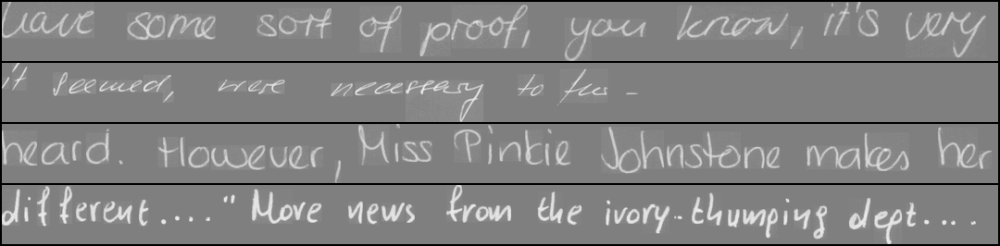
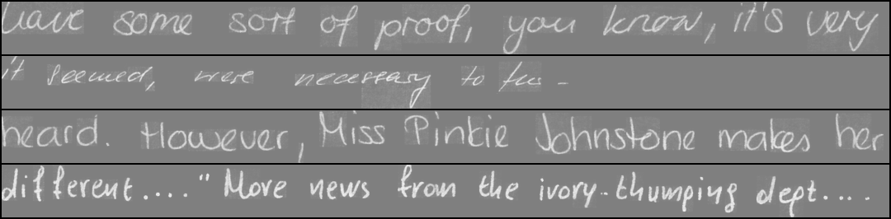
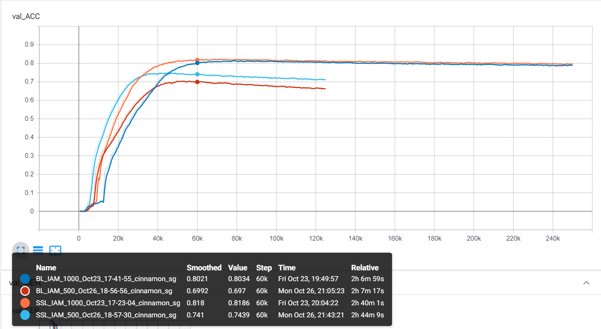
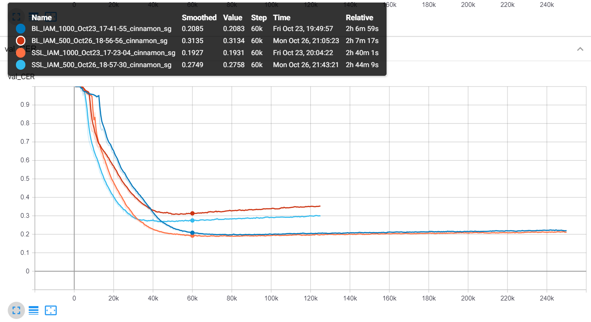

# semi-supervised-OCR
Application of Variational Auto-Encoder in semi-supervised learning for OCR

### Reconstruction

    
     
    <em>Fig. 1: input textline images </em>

    
     
    <em>Fig. 2: reconstructed textline images </em>

### Training Evolution

    
     
    <em>Fig. 3: accuracy evolution of validation set </em>

    
     
    <em>Fig. 4: cer evolution of validation set </em>

